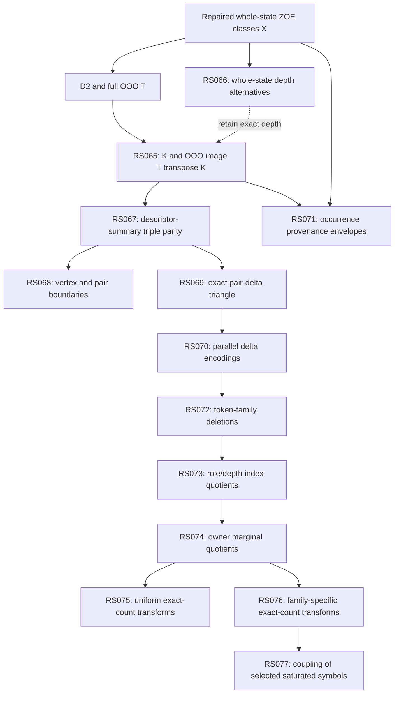

# RS065–077 transformation audit

Status: staging audit at `a0d439449e398c5ce5a70ccbc9b3a38f3df16928`; canonical owner `research/semantic-quotient`. Authority 1.2 is unchanged. This is a source-level reconstruction and bounded synthetic structural check, not a new scalar replay, fresh qualification, theorem, or promotion. EW-RS059 primary `3x6-k4` and backup `5x3-k4` remain SEALED.

## Typed DAG

Let X be the distinct repaired `ROLE_CAPPAR_REL_INC` whole-state ZOE classes on a declared carrier. The descriptor retains width, jointly canonicalized role-attached capacity parity and owner-separated residual-mask incidence at exact frontier-relative depth. P is descriptor presence and O its multiplicity parity. D2 is the constant plus complete degree-one/two P/O matrix; T is the complete three-distinct-descriptor OOO matrix. Let K=ker(D2^T). The actual downstream scalar question is whether the two-bit scalar linear map restricted to K factors through a structural map on T^T K. It is not the claim that a triangle key alone predicts a board value.

Arrows express the actual data source. Warrant `parent` records the research sequence and is not proof of a quotient arrow. In particular RS066, RS068 and RS071 do not supply replacement inputs to the selected RS069–077 chain.

| Stage | Actual source → target | Classification and qualification boundary |
|---|---|---|
| 065 | X, D2, T → deterministic basis of K, then image T^T K | Linear kernel/image construction on a new domain. Basis representatives depend on ordering; ranks and kernels do not. Not a scalar-preserving quotient of individual boards. |
| 066 | Exact repaired state identity → frontier/positive or frontier/positive-parity depth identity, reaggregate counts into ZOE | Whole-state coordinate quotient test, upstream of K. Cannot substitute its class-count comparison for a dependency-image quotient test. The selected continuation retains exact depth. |
| 067 | Exact descriptor triples → sorted triples of width/cap/owner-depth-histogram summaries; extend linearly by GF(2) parity | Genuine deterministic triangle-key quotient and induced linear image map. The ladder contains incomparable branches, not one successive-deletion chain: mask-size profile does not determine depth histogram, and depth histogram does not retain mask grouping. |
| 068 | Selected 067 triple-motif vector → GF(2) vertex incidence, pair incidence, or their direct sum | Genuine linear maps, not one-hot relabelings of a triple. Vertex/pair operators count multiplicity, including repeated summary vertices. Triple control is the identity. Failure of these particular boundaries does not establish universal irreducible triadic causality. |
| 069 | Three selected 067 vertices → sorted multiset of three exact signed token differences | Deterministic quotient in the frozen lexicographic vertex gauge. Width W, capacity bits C:i and owner-depth counts D0:d/D1:d form the integer vectors. Delta=b−a for raw-string lo<hi. Discarding absolute vertex identity does not prove invariance to a different vertex ordering/gauge. Basefree two-leg and anchored variants are sibling maps from full vertices. |
| 070 | Exact signed token deltas → SUPPORT, PARITY, SIGN, ABS_MAG, SIGNED_PARITY, SIGNED_CLIPPED_MAG, EXACT | Parallel deterministic quotients from exact deltas; not a linear refinement ladder. SIGNED_PARITY cannot in general be recovered from SIGN (positive 1 and positive 2 have identical signs, different retained parity). Sorting pair signatures removes pair order, not inherited orientation. |
| 071 | Structural occurrence provenance + base descriptor → descriptor-indexed sets of occurrence-summary variants → triple parity | Provenance/domain augmentation and dataset-level envelope construction, not a demonstrated quotient of 070 deltas or 067 selected summaries. On a frozen descriptor catalog it is a deterministic lookup, but this does not provide a carrier-independent per-descriptor formula. Reflection qualification is separately required before D+/D− folding. |
| 072 | 070 SIGN or SIGNED_PARITY signatures → each subset of W,C,D0,D1 tokens | Genuine coordinate-family deletion separately within each encoding. Selected C+D0+D1 deletes W. Minimality is relative to the declared subset lattice, not all possible feature maps. |
| 073 | 072 C+D0+D1 signed terms → roleless C+/C− counts and owner-separated depthless D0+/D0−/D1+/D1− counts (plus other grid points) | Genuine index quotient within each fixed encoding; counts are of changed coordinates, not signed delta magnitudes. SIGN and SIGNED_PARITY remain separate source branches. Roleless/depthless does not erase the upstream gauge used to orient differences. |
| 074 | Selected signed-parity roleless/depthless six counts → C unchanged; D±=D0±+D1± and A±=abs(D0±−D1±) | Genuine quotient of the frozen pair-bucket representation. D_UNORDERED_CHANNELS preserves cross-sign owner pairing, whereas symmetric marginals forget it. Owner-symmetric output buckets are not by themselves proof of equivariance under swapping upstream owner labels and recomputing lexicographic orientation. |
| 075 | Exact 074 C±,D±,A± counts → same count function on each bucket | Six sibling count algebras from exact counts: presence, parity, ZOE, clip2, clip3, exact. ZOE and clip3 are incomparable over nonnegative integers; numerical thresholds are not a total information order. This count layer is distinct from original descriptor ZOE multiplicity. |
| 076 | Exact 074 counts → Cartesian grid of presence/ZOE/clip2/clip3 per C,D,A family | Genuine quotients of exact 074 counts. The entire grid is NOT a quotient of the selected 075 clip3 output: ZOE(3) differs from ZOE(4), but clip3 identifies them. The selected C=presence,D=clip3,A=clip2 does factor through uniform clip3. |
| 077 | Selected 076 C=presence,D=clip3,A=clip2 six symbols → five sign-coupling maps per family, then sorted triple keys | Genuine quotients of these saturated symbols, using interval semantics, not arithmetic on exact raw counts. Saturated symbol 3 represents [3,+inf], not integer 3. TOTAL/SIGNED_NET/ABS_NET use interval sum/difference/absolute-value; UNORDERED_PAIR and SEPARATED use symbol labels. Candidate order is a finite partial order. |

## Evidence and checked limits

The source anchors and exact Git-blob byte hashes are in `LINEAGE_SOURCE_AUDIT.json`; `LINEAGE_BUILD_AUDIT.mjs` generates it without importing any runner or reading a scalar-result artifact. The shared checkout advanced to `c04de18a91ccdd3fbf4c25087999d7c05b6c90f6` during this work for the parent's RS076 freeze repair. Generators initially stopped on the head mismatch, then were changed to explicitly read source blobs at the original pinned head. The baseline claim was not moved to the new commit. Imported pure structural libraries are checked for changes against the pinned revision. Key implementations inspected:

- `run-matched-degree2-dependency-quotient.mjs`, `matchedDegree2DependencyQuotient`: sorted structural rows, lower pivot traces, inherited OOO residues.
- `run-role-cappar-depth-compression.mjs` and EW-RS066: whole-state depth transform and retained incidence semantics.
- `run-ooo-descriptor-motif-functional-ladder.mjs`, `descriptorSummary` and `motifRow`: exact fields and parity extension.
- `run-ooo-motif-hypergraph-boundary.mjs`, `oooMotifHypergraphBoundaryAudit`: distinct vertex/pair linear maps.
- `ooo-exchange-circuit-lib.mjs`: raw-string pair orientation, exact token vectors, separate compressions and basefree candidates.
- `ooo-pair-delta-family-lib.mjs`, `ooo-pair-delta-index-lib.mjs`, `ooo-pair-delta-owner-lib.mjs`: actual deletion, count and marginal maps.
- `ooo-pair-delta-bucket-lib.mjs`, `ooo-six-bucket-family-saturation-lib.mjs`: raw 074 input for both 075 and 076.
- `ooo-sign-channel-coupling-lib.mjs`: interval-valued coupling and explicit finite-domain refinement tests.
- EW-RS071: occurrence provenance, descriptor-envelope domain and structural reflection obligations.

Checked here: source-level dataflow; structural count nonfactorization witness 3 versus 4; selected 076 map factors through clip3 on a finite count grid; 077 maps factor through their selected symbol inputs by construction; finite 077 source-symbol partition relation. These checks contain no board/scalar solve. Synthetic unrestricted count examples prove a general nonfactorization claim; they are not witnesses that both counts occur on a particular board carrier.

Recorded but not independently rerun here: the published RS065 OOO image ranks 75/294/16, RS067 selected motif ranks 75/288/16, selected scalar exactness and failure claims, RS066 exact-depth necessity, RS071 reflection/causality dispositions, all state enumeration and scalar extraction. Historical metadata is not new qualification.

`RS077_FREEZE_SEQUENCE_AUDIT_0_1.json` records a repaired temporal claim: complete 125-candidate preparation/freeze before RS077 replay **per declared carrier**, with 375 reproduced audits and byte-identical published evidence. Current source calls `freezeGridThenReplay(SIGN_CHANNEL_GRID, prepareCandidate, replayCandidate)`. This audit checks that call and helper dataflow; it does not independently reproduce the historical run or widen per-carrier freezing into global no-outcome-access. Upstream training outcomes already exist.

Qualification disposition: the sequence must be represented as a typed DAG; no defect in the inspected deterministic feature formulas is established by this audit. Discovery disposition: OPEN for gauge-independent semantics, intrinsic provenance envelopes, carrier transfer, and sufficiency on a fresh non-affine carrier. No Q_A/Q_F, universal cubic, 7x6, minimal-algebra, or center-opening claim follows.
